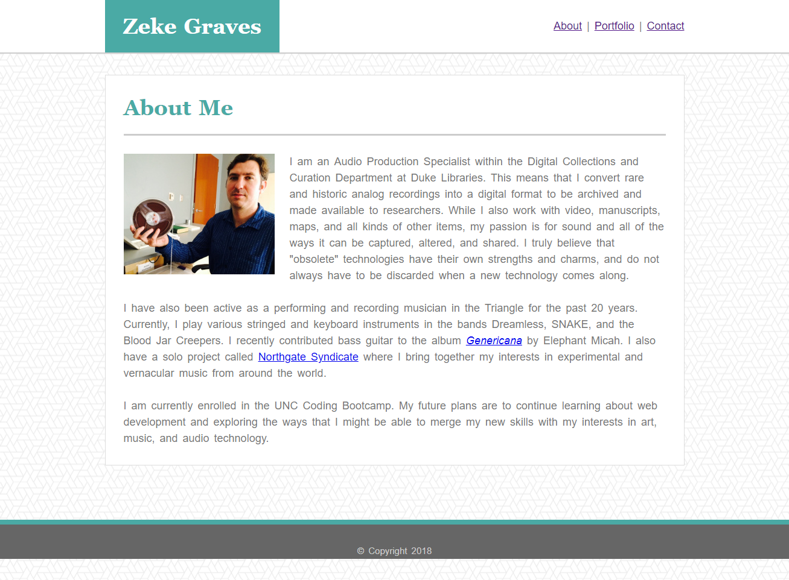
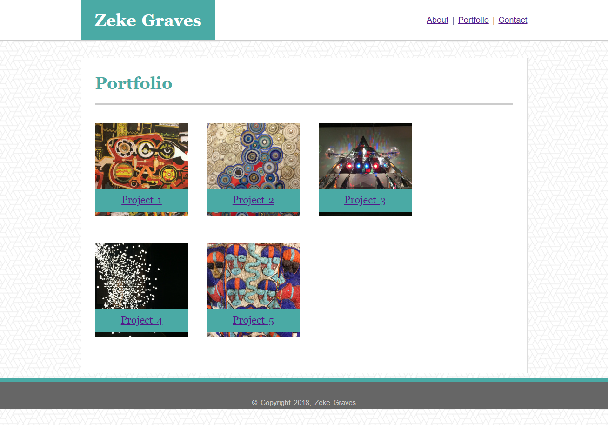
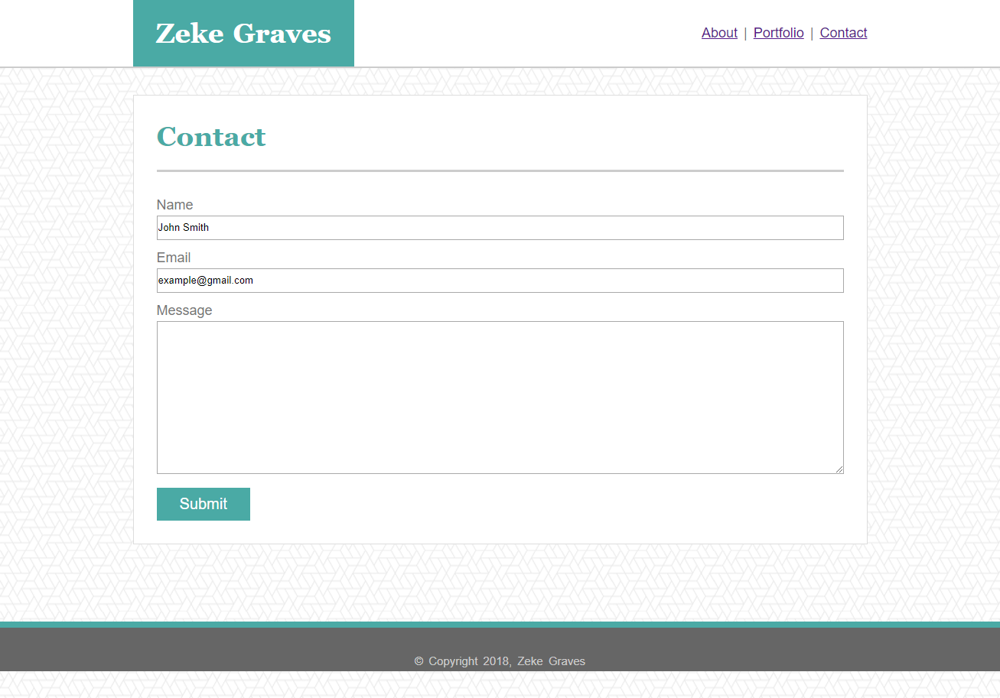

# Basic-Portfolio
## UNC Coding Bootcamp Homework #1  8-30-2018

This assignment required building a simple website with Bio, Portfolio, and Contact pages based on templates given only as jpeg images. 

We were tasked with duplicating the layout and design of these images as closely as possible using only HTML and CSS.

My deployed app can be viewed here: https://zinc-glaze.github.io/Basic-Portfolio/

### Screenshots

